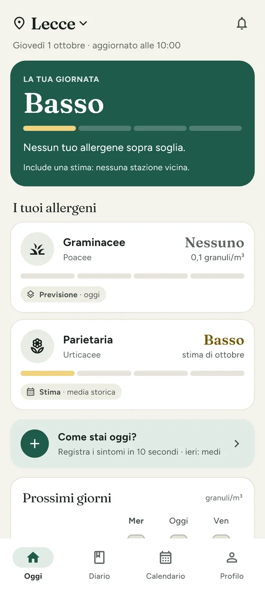
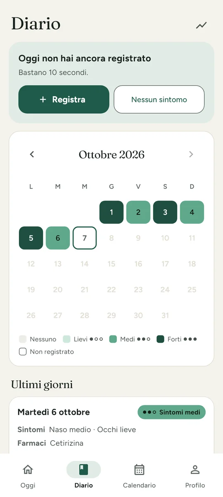
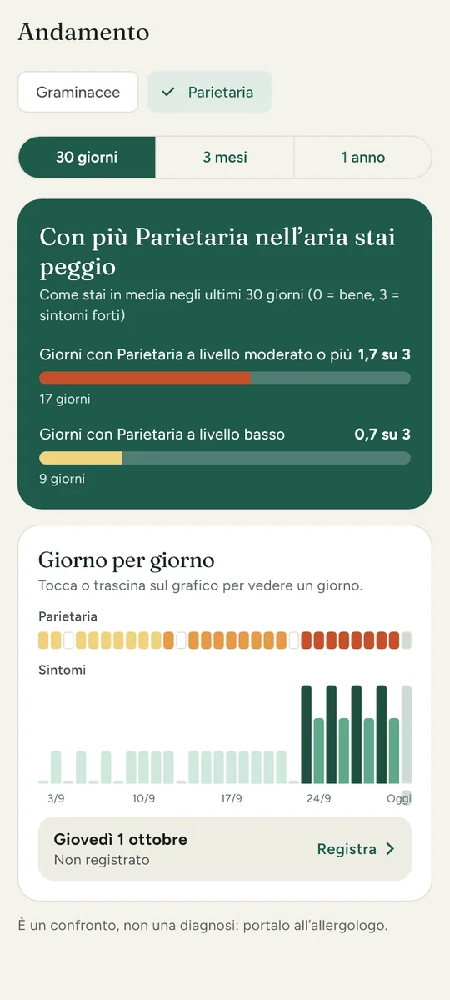
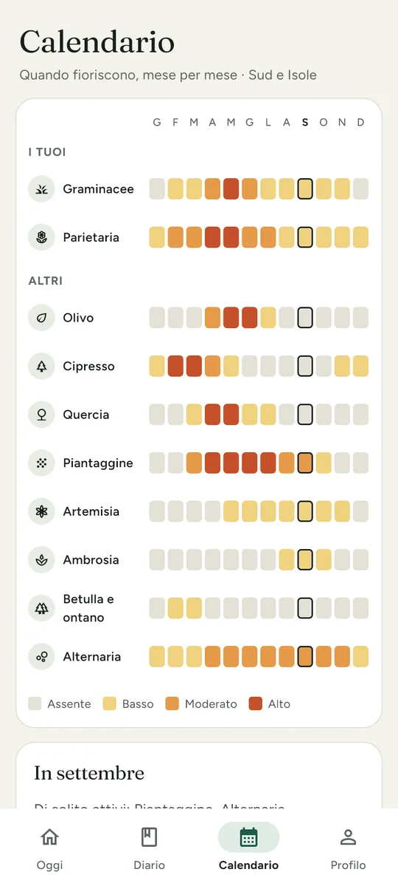

# 🌾 Allergy Radar

[](https://github.com/lorenzocaputodev/allergy_radar/actions/workflows/ci.yml)  

> **Scopri quanti pollini ci sono nella tua zona e quali ti danno davvero fastidio.**

- 🌿 Graminacee, Parietaria e altri 8 allergeni in tutta Italia, con la fonte di ogni dato sempre in vista
- 🔒 Senza account e senza pubblicità: i tuoi dati restano solo sul tuo telefono

## 📲 Scarica l’app

L’app è in sviluppo e non c’è ancora una versione pubblicata. Quando uscirà, l’APK sarà nella pagina delle **[release](https://github.com/lorenzocaputodev/allergy_radar/releases)**; per ora si compila dal sorgente, come spiegato più sotto.

## 📸 Schermate

<p align="center">
  
  
  
  
</p>

<p align="center"><sub>Oggi · Diario · Andamento · Calendario</sub></p>

---

## ✨ Funzionalità principali

- 🧭 Oggi: livello della giornata, i tuoi allergeni, i prossimi giorni, l’aria e gli altri pollini in zona
- 🏷️ Ogni valore dice se è una **previsione**, una **misura** o una **stima**
- 🔎 Dettaglio di ogni allergene con andamento, stagione e soglia personale
- 📓 Diario dei sintomi da 10 secondi, con farmaci, sonno e ore all’aperto
- 📈 Andamento: per ogni allergene, se stai peggio quando sale, e giorno per giorno
- 🗓️ Calendario stagionale per **Nord**, **Centro** e **Sud e Isole**
- 📍 Luogo da ricerca città o dalla posizione approssimativa, con il nome del comune
- 📲 Widget Android per la schermata Home
- 🔔 Avvisi, proposti già al primo avvio, e l’elenco di quelli ricevuti
- 📄 PDF per l’allergologo, diario in CSV, backup e ripristino
- 🎨 Tema **scuro / chiaro / sistema**
- 🔒 Dati salvati localmente sul dispositivo

---

## 🔔 Sistema notifiche

L’app può mandare tre avvisi, ognuno con il suo orario:

- ☀️ Briefing del mattino, anche solo nei giorni sopra la tua soglia
- 📈 Domani peggiora, la sera
- 📓 Promemoria del diario, se oggi non hai ancora registrato

Le notifiche sono gestite su Android tramite:

- `flutter_local_notifications`
- `workmanager`

---

## 🛠️ Piattaforme

- 🤖 **Android**: piattaforma prioritaria
- 🖥️ **Windows**: supporto utile per debug e test locali

---

## 🧰 Requisiti per compilare

Prerequisiti, con le versioni su cui la build è verificata:

- Flutter **3.47.5** stable (Dart 3.13.4)
- Android SDK con platform **android-36**, build-tools 36.0.0 e NDK 28.2.13676358
- **JDK 21** — Gradle 8.14.5 non supporta JDK 25, quindi va agganciato con
  `flutter config --jdk-dir "<percorso del JDK 21>"`
- Visual Studio Code

La catena di build usa Gradle 8.14.5, AGP 8.13.2 e Kotlin 2.2.21, volutamente
entro la linea 8.x di AGP.

Senza `android/key.properties`, `flutter build apk --release` usa la chiave di debug.

`android/gradle.properties` dimensiona il daemon Gradle a 2 GB di heap: su
macchine con poca RAM valori più alti fanno terminare il daemon a metà build.

---

## ⚡ Compilare il progetto

Se vuoi compilare il progetto sul tuo PC:

### 1. Clona la repository
```bash
git clone https://github.com/lorenzocaputodev/allergy_radar.git
cd allergy_radar
```

### 2. Installa le dipendenze
```bash
flutter pub get
```

### 3. Genera le icone ufficiali
```bash
dart run flutter_launcher_icons
```

### 4. Avvia l’app
```bash
flutter run
```

---

## 📂 Struttura essenziale

- `lib/models/` → allergeni, livelli, luoghi, stazioni e diario
- `lib/services/` → fonti dei dati, avvisi, posizione, widget, backup e PDF
- `lib/data/` → scelta della fonte di ogni allergene e cache
- `lib/state/` → stato applicativo e persistenza
- `lib/screens/` → schermate principali
- `lib/widgets/` → componenti UI riutilizzabili
- `lib/theme/` → colori e temi
- `android/app/src/main/kotlin/dev/lorenzocaputo/allergyradar/widget/` → implementazione nativa del widget Android
- `docs/` → documentazione tecnica: architettura, fonti dei dati, sviluppo, design e decisioni

---

## 🔐 Privacy e dati

- Nessun account richiesto
- Nessun backend: l’app usa solo i dati aperti di Open-Meteo e ISPRA
- Posizione solo approssimativa, e solo se la chiedi tu; il nome del comune lo ricava il telefono
- Dati salvati localmente sul dispositivo

Previsioni © Copernicus/CAMS tramite Open-Meteo e misure della rete POLLnet-SNPA di ISPRA, entrambe con licenza CC BY 4.0.
L’app informa, non sostituisce il medico.

---

## 👨‍💻 Sviluppo

Durante lo sviluppo, il debugging e la rifinitura del progetto è stato utilizzato supporto AI come assistenza tecnica per troubleshooting, revisione della documentazione, verifica di problemi tecnici e supporto alla scrittura e pulizia del codice.

---

## 👤 Autore

**Lorenzo Caputo**  
GitHub: [lorenzocaputodev](https://github.com/lorenzocaputodev)  
Portfolio: [lorenzocaputo.is-a.dev](https://lorenzocaputo.is-a.dev/)
